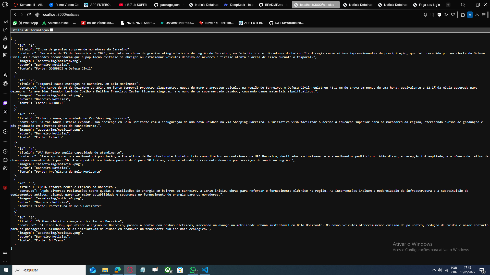
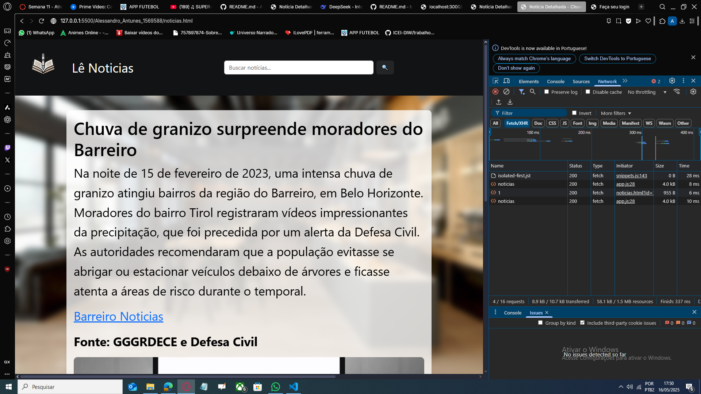

# Lê Notícias

**Lê Notícias** é um portal de notícias locais focado em fornecer informações sobre eventos, condições climáticas e atualizações importantes da cidade de Belo Horizonte, especialmente na região do Barreiro. O site é desenvolvido com o uso de tecnologias como HTML, CSS, JavaScript, Bootstrap e recursos personalizados para uma experiência de usuário fluida e dinâmica.

## Tecnologias Utilizadas

- **HTML**: Estruturação das páginas web.
- **CSS**: Estilização do layout e design visual, incluindo o uso de propriedades avançadas e personalizadas.
- **JavaScript**: Funcionalidades interativas, como busca de notícias.
- **Node.js e Json Server** : Para guardar informações e manipular dinâmica de conteúdo.
- **Bootstrap 5**: Framework para design responsivo e componentes interativos como carrosséis e formulários.
- **Bootstrap Icons**: Ícones para redes sociais e outros componentes de interface.

## Funcionalidades

### 1. **Carrossel de Notícias**
   - Exibição dinâmica de notícias em destaque com imagens e descrições, permitindo que os usuários cliquem nas notícias para mais detalhes.

### 2. **Busca de Notícias**
   - O site permite ao usuário buscar por notícias específicas com a barra de pesquisa localizada no cabeçalho. A busca é feita através da correspondência de títulos e conteúdos, sem diferenciação de acentos.

### 3. **Exibição de Notícias**
   - As notícias são organizadas em cartões que exibem título, imagem e uma descrição curta, permitindo um acesso rápido às informações.

### 4. **Responsividade**
   - O design é totalmente responsivo, adaptando-se a diferentes tamanhos de tela, com um layout otimizado para desktop, tablet e mobile.

### 5. **Redes Sociais**
   - Ícones de redes sociais são incluídos no rodapé, permitindo aos usuários acompanhar o projeto nas principais plataformas sociais (Instagram, Facebook, YouTube, Twitter e TikTok).
### 6. **json server**
   - backend em node.js e json server.
   
   

## Estrutura do Projeto

LêNoticias/

├── assets/

│   ├── css/
│   │   ├── login.css          # Estilo da página de login
│   │   └── style.css          # Estilos gerais do site

│   ├── img/                   # Imagens usadas no site (logo, ilustrações, etc.)

│   └── js/                    # Scripts JavaScript do projeto (se houver)

│
├── cadastro.html              # Página de cadastro de usuário
├── index.html                 # Página principal com carrossel e notícias
├── login.html                 # Página de login
├── noticias.html              # Página com os detalhes de uma notícia

│
├── db/                        # Pasta do backend fake (JSON Server)
│   ├── db.json                # Base de dados em JSON simulada
│   ├── package.json           # Configurações e dependências do projeto
│   ├── package-lock.json      # Arquivo de bloqueio de dependências
│   └── node_modules/          # Dependências instaladas (gerado automaticamente)

│
└── README.md                  # Documentação do projeto


## Como Rodar o Projeto

1. **Clone o repositório**:

   ```bash
   git clone https://github.com/AlessandroFTunes/ADS-project-1-website


